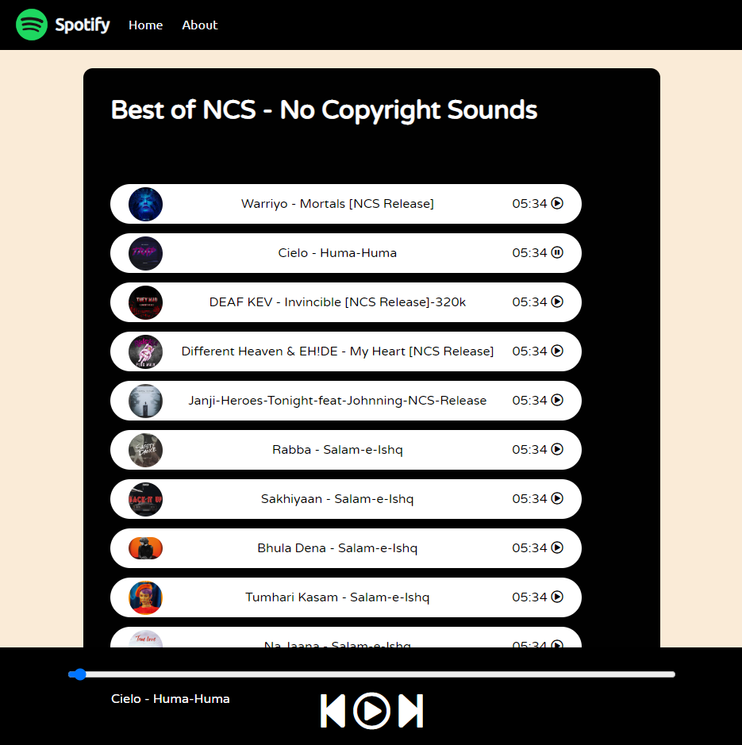

# Spotify-clone
A simple music player using HTML,CSS and JavaScript to play songs.

# Features:

 - Play song on one click
 - Next and forward option
 - Use progressbar to play with the time of songs.

# Tools:
 - HTML5
 - CSS
 - JavaScript
 - VsCode
 - Git

# Start contributing

Make sure you have all the basic tools before you start working on this project.Fork this repository and contribute back using pull requests to the main branch.

